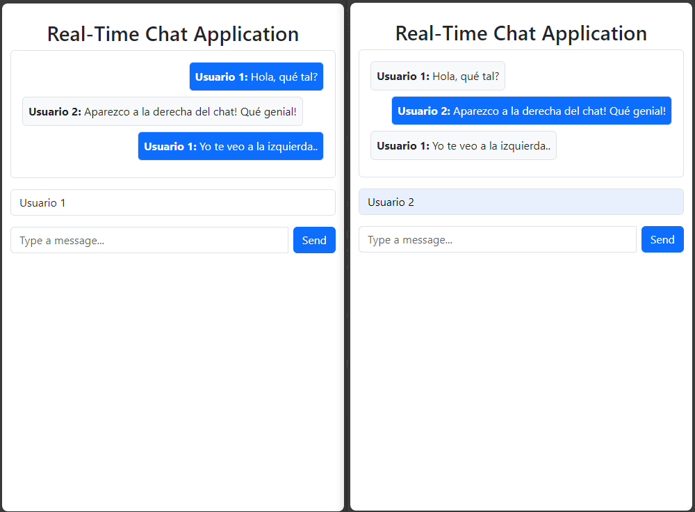

# chatapp

Chat cual puede ser observados por todos los usuarios que ingresen al mismo, funciona desde el mismo localhost.
Quería aprender lo básico sobre Spring WebSocket y Spring Messaging (con protocolo STOMP).

## Imagen del Proyecto

Aquí está una captura de pantalla del proyecto en ejecución:



## Tecnologías Utilizadas

- **Backend**: 
  - Spring Boot (3.x)
  - Spring WebSocket
  - Spring STOMP
  - Spring Messaging
  - Java 21
  
- **Frontend**: 
  - HTML/Bootstrap
    
- **Otras Herramientas**:
  - Maven para la gestión de dependencias

## Características

- **Chat en tiempo real**: Los mensajes se envían y reciben al momento de ser enviados.
- **Conexión WebSocket**: Uso de WebSocket para la comunicación bidireccional en tiempo real.
- **Colorización de mensajes**: Diferencia los mensajes del usuario actual y los demás en burbujas espaciadas.

## Pasos para Ejecutar el Proyecto

1. **Clonar el repositorio**:
   ```bash
   git clone <url-del-repositorio>
   ```

2. **Ejecutar el backend**

3. **Acceder a la aplicación**:
   Accede a http://localhost:8080 para ver la aplicación en funcionamiento.
